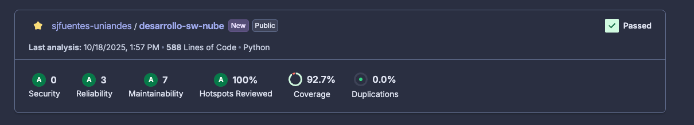
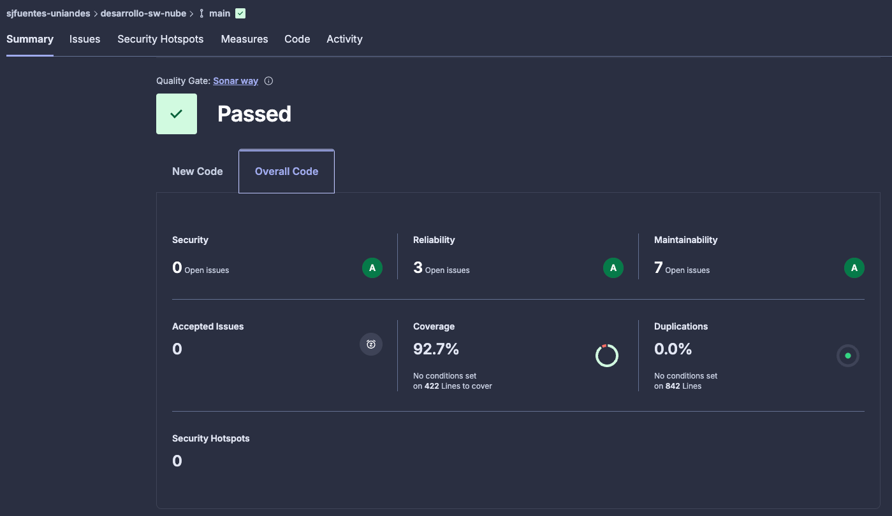

# Documentación Completa - API de Competencia de Habilidades

## Tabla de Contenidos
1. [Arquitectura y Tecnologías](#arquitectura-y-tecnologías)
2. [Arquitectura AWS](#Arquitectura-AWS)
3. [Integraciones](#integraciones)
4. [Sustentación](#sustentación)

## Arquitectura y Tecnologías

### Diagrama de componentes

### Diagrama de despliegue

### Diagrama de arquitectura en aws

### Diagrama de flujo de procesos

### Modelo de datos

### Stack Tecnológico
- **Backend**: FastAPI (Python 3.11)
- **Base de Datos**: PostgreSQL 17
- **Cache/Broker**: Redis 7
- **Procesamiento**: Celery Workers
- **Proxy Reverso**: Nginx
- **Autenticación**: JWT (JSON Web Tokens)
- **Validación**: Pydantic
- **Hashing**: bcrypt
- **Procesamiento Video**: FFmpeg
- **Testing**: pytest + Postman/Newman
- **Análisis de Código**: SonarCloud
- **CI/CD**: GitHub Actions

## Arquitectura AWS

### Instancias EC2
Se configuraron 3 instancias EC2 con las siguientes características
- **Sistema Operativo**: Ubuntu
- **vCPU**: 2 vCPUs
- **RAM**: 2 GiB
- **Disco**: 50 GB de almacenamiento

#### Puertos de conexión
| Instancia | Puerto | Protocolo | Descripción |
|--|--|--|--|
|  Web Server | 22  | TCP | Conexión SSH |
|  Web Server | 80  | TCP | HTTP tráfico entrante |
|  Web Server | 443 | TCP | HTTPS tráfico entrante |    
| Worker | 22 | TCP | Conexión SSH |
| Worker | 6379 | TCP | Trabajo de la cola de mensajería |
| File Server | 22 | TCP | Conexión SSH |
| File Server | 2049 | TCP | Comunición NFS con Web Server y Worker |

### RDS Database
Se utilizó la siguiente configuración para la base de datos
 - **Motor de Base de Datos**: PostgreSQL 17
    - **vCPU**: 2 vCPUs
    - **RAM**: 2 GB
    - **Almacenamiento**: 100 GB SSD

### Manejo de costos
Se implementó una alarte de costo con AWS CloudWatch y SNS Topic de tal forma que, una vez la proyección de gastos de la cuenta llegue a la mitad de los créditos, se pueda tomar las acciones necesarias para corregirlos. 

Además para el caso de la base de datos, solo se mantiene activa durante el usa, una vez se termina de usar la instancia se detiene y cuando se termine la entrega la instancia se destruirá.

### Manejo de credenciales
Se utilizaron AWS Secrets Manager para el manejo de credenciales de la base de datos y otros servicios, evitando así almacenar credenciales sensibles directamente en el código fuente.

## Pruebas de Capacidad

#### `load_testing/`
Infraestructura completa para pruebas de capacidad y observabilidad:
- **Locust**: Generador de carga para simular usuarios concurrentes
- **Prometheus**: Recolección de métricas del sistema (CPU, memoria, conexiones)
- **Grafana**: Visualización de métricas en tiempo real
- **Scripts automatizados**: Ejecución de pruebas y gestión de observabilidad
- **Resultados**: CSV con métricas de 5 pruebas ejecutadas

#### `capacity_planning/`
Documentación detallada del Escenario 1 (Capacidad Capa Web):
- **Plan de pruebas completo**: 2,000+ líneas con metodología, resultados y análisis
- **Capacidad máxima identificada**: 100 usuarios @ 18.84 RPS
- **Zona segura sostenida**: 80 usuarios @ 18.63 RPS (validado 5 minutos)
- **5 Bottlenecks identificados**: Con severidad y soluciones propuestas
- **Curvas de rendimiento**: Análisis de degradación y puntos de quiebre

## Integraciones

#### Reporte de Análisis de SonarQube

