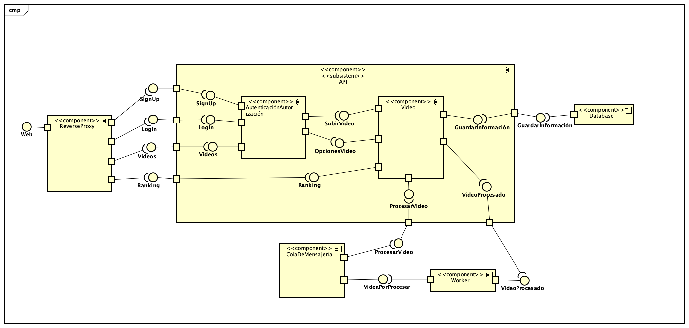
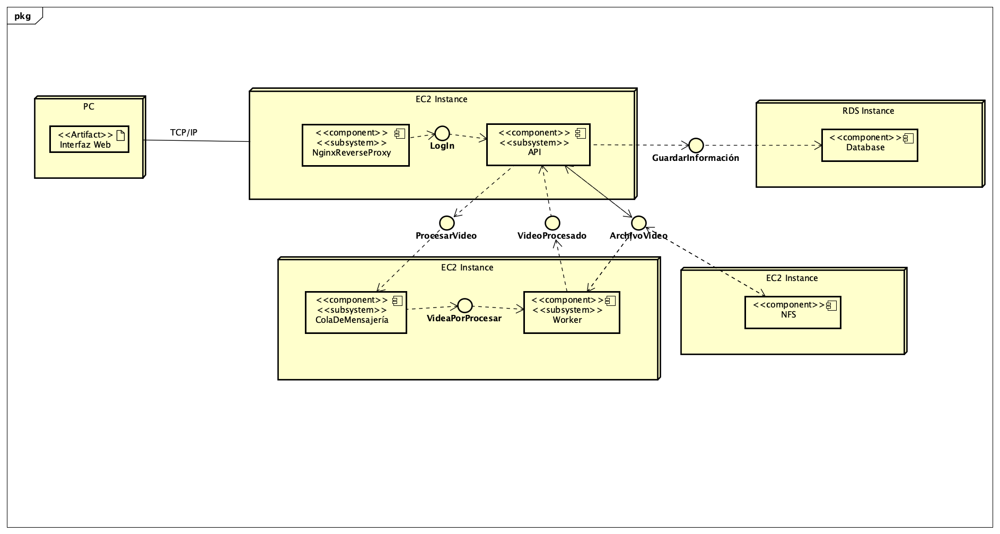
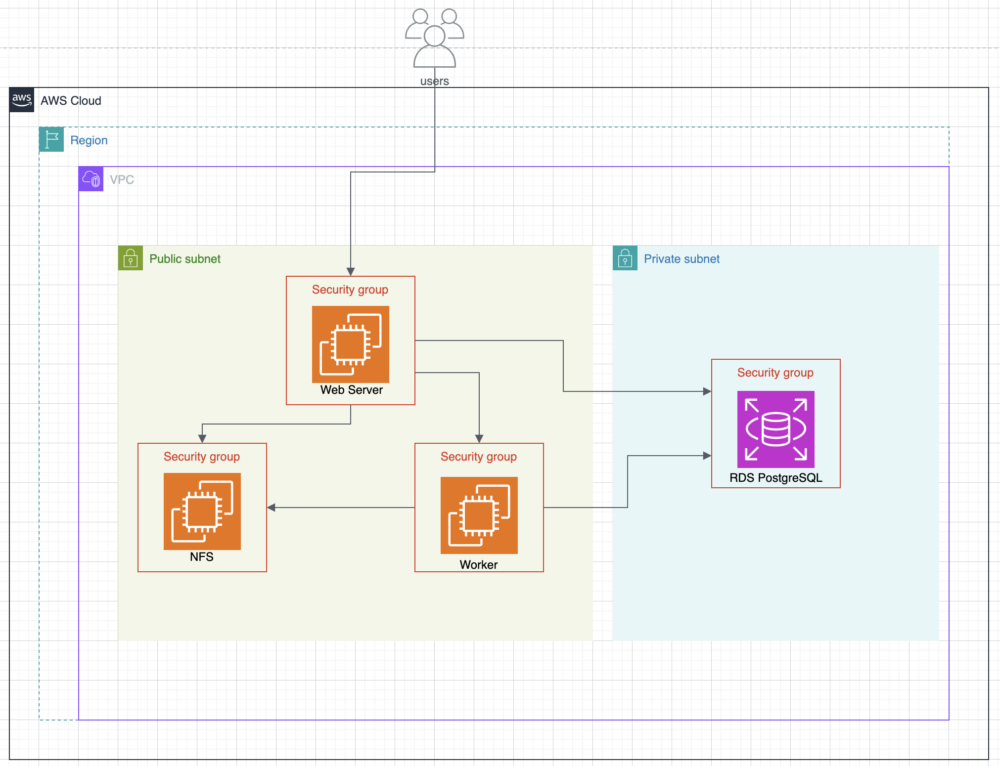
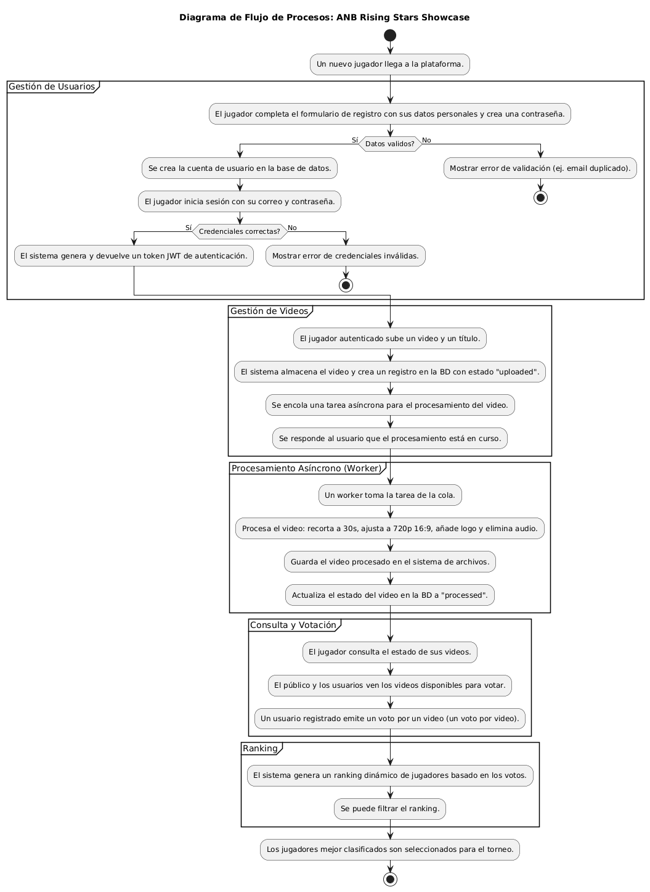
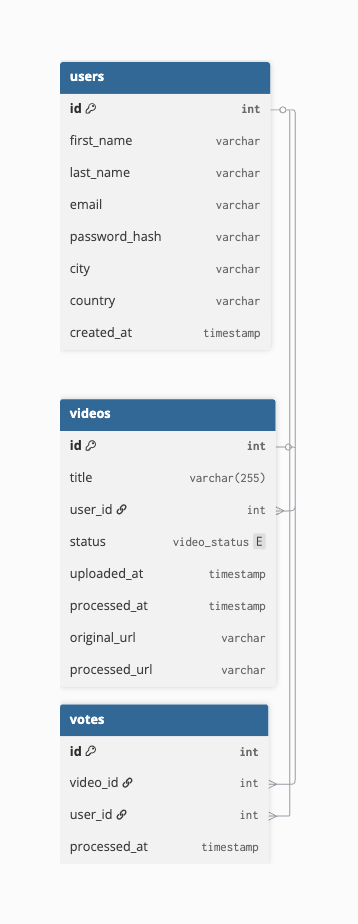
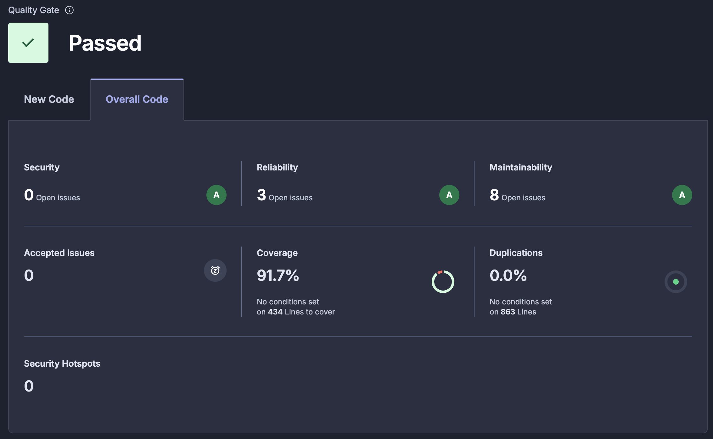

# Documentación Completa - API de Competencia de Habilidades

## Tabla de Contenidos
1. [Arquitectura y Tecnologías](#arquitectura-y-tecnologías)
2. [Arquitectura AWS](#Arquitectura-AWS)
3. [Cambio realizados](#Cambios-Realizados)
3. [Pruebas de carga](#Pruebas-de-Capacidad)
4. [Integraciones](#integraciones)
5. [Sustentación](#sustentación)

## Arquitectura y Tecnologías

### Diagrama de componentes

### Diagrama de despliegue

### Diagrama de arquitectura en aws

### Diagrama de flujo de procesos

### Modelo de datos

### Stack Tecnológico
- **Backend**: FastAPI (Python 3.11)
- **Base de Datos**: PostgreSQL 17
- **Cache/Broker**: Redis 7
- **Procesamiento**: Celery Workers
- **Proxy Reverso**: Nginx
- **Autenticación**: JWT (JSON Web Tokens)
- **Validación**: Pydantic
- **Hashing**: bcrypt
- **Procesamiento Video**: FFmpeg
- **Testing**: pytest + Postman/Newman
- **Análisis de Código**: SonarCloud
- **CI/CD**: GitHub Actions

## Arquitectura AWS

### Instancias EC2
Se configuraron 3 instancias EC2 con las siguientes características
- **Sistema Operativo**: Ubuntu
- **vCPU**: 2 vCPUs
- **RAM**: 2 GiB
- **Disco**: 50 GB de almacenamiento

#### Puertos de conexión
| Instancia | Puerto | Protocolo | Descripción |
|--|--|--|--|
|  Web Server | 22  | TCP | Conexión SSH |
|  Web Server | 80  | TCP | HTTP tráfico entrante |
|  Web Server | 443 | TCP | HTTPS tráfico entrante |    
| Worker | 22 | TCP | Conexión SSH |
| Worker | 6379 | TCP | Trabajo de la cola de mensajería |
| File Server | 22 | TCP | Conexión SSH |
| File Server | 2049 | TCP | Comunición NFS con Web Server y Worker |

### RDS Database
Se utilizó la siguiente configuración para la base de datos
 - **Motor de Base de Datos**: PostgreSQL 17
    - **vCPU**: 2 vCPUs
    - **RAM**: 2 GB
    - **Almacenamiento**: 100 GB SSD

### Manejo de costos
Se implementó una alarte de costo con AWS CloudWatch y SNS Topic de tal forma que, una vez la proyección de gastos de la cuenta llegue a la mitad de los créditos, se pueda tomar las acciones necesarias para corregirlos. 

Además para el caso de la base de datos, solo se mantiene activa durante el usa, una vez se termina de usar la instancia se detiene y cuando se termine la entrega la instancia se destruirá.

### Manejo de credenciales
Se utilizaron AWS Secrets Manager para el manejo de credenciales de la base de datos y otros servicios, evitando así almacenar credenciales sensibles directamente en el código fuente.

## Cambios Realizados

### Código de la Aplicación
- **Variables de entorno para directorios**: Se agregaron variables `UPLOADS_DIR` y `PROCESSED_DIR` en `video_tasks.py` para configurar las rutas de archivos de manera flexible
- **Manejo de directorios**: Se implementó la función `ensure_upload_dir()` en `video_router.py` para crear directorios de forma segura, evitando errores en entornos de solo lectura
- **Configuración de recursos**: Se ajustaron los límites de CPU y memoria en los archivos Docker Compose para optimizar el rendimiento

### Pruebas Unitarias
- **Mocks para archivos**: Se agregaron mocks de `os.path.exists` en todos los tests de `TestProcessVideoTask` para simular la existencia de archivos
- **Corrección de expectativas**: Se actualizaron las expectativas de los tests para usar `"./processed"` en lugar de `"processed"` para coincidir con las rutas reales
- **Manejo de errores**: Se mejoró el manejo de errores en los tests para casos donde los archivos no existen

### Separación de Docker Compose
- **docker-compose.web.yml**: Archivo dedicado para el servidor web con configuración específica de recursos (1.5 CPU, 1.7G RAM)
- **docker-compose.worker.yml**: Archivo dedicado para los workers de Celery con configuración optimizada para procesamiento (1.5 CPU, 1.7G RAM)
- **Despliegue independiente**: Permite escalar web servers y workers de forma independiente según las necesidades de carga

## Pruebas de Capacidad

#### `cloud_load_testing/`

#### `capacity_planning/`

## Integraciones

#### Reporte de Análisis de SonarQube

