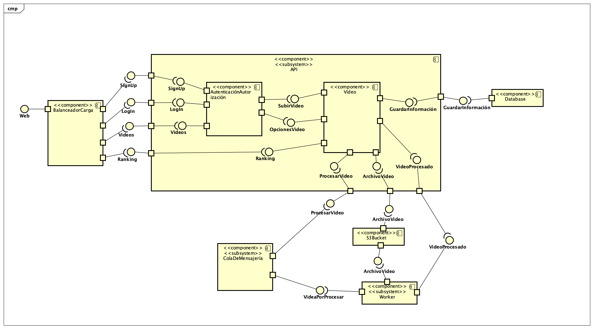
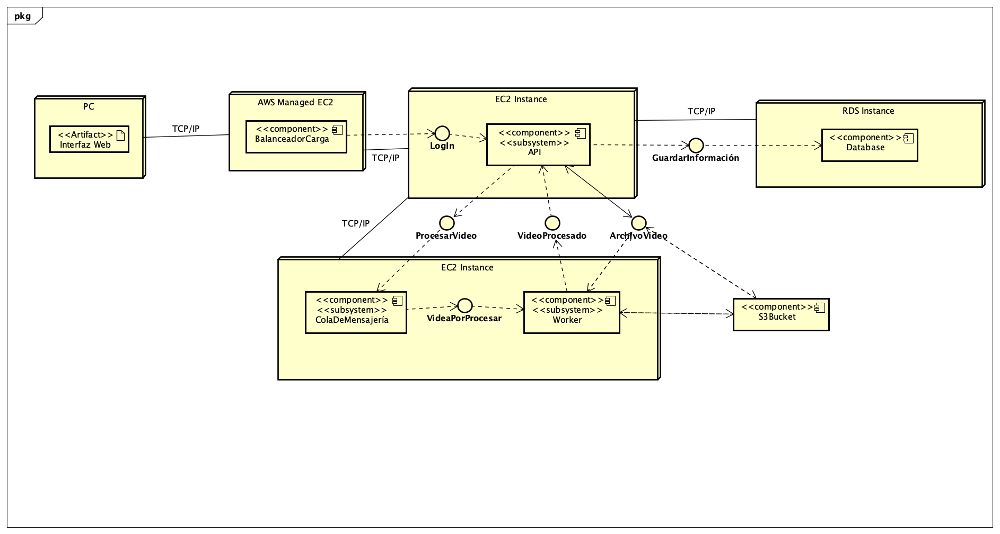
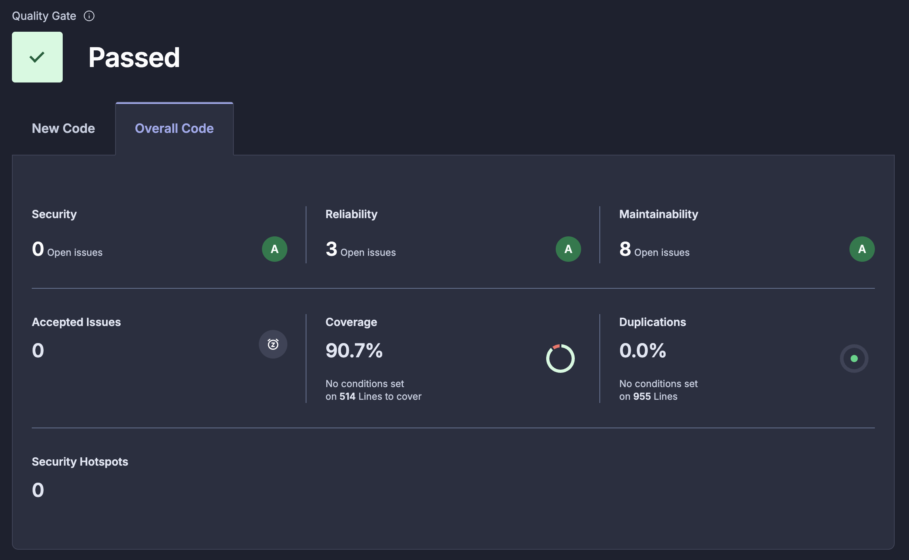

# Documentación Completa - API de Competencia de Habilidades

## Tabla de Contenidos
1. [Arquitectura y Tecnologías](#arquitectura-y-tecnologías)
2. [Arquitectura AWS](#Arquitectura-AWS)
3. [Cambio realizados](#Cambios-Realizados)
3. [Pruebas de carga](#Pruebas-de-Capacidad)
4. [Integraciones](#integraciones)

## Arquitectura y Tecnologías

### Diagrama de componentes

### Diagrama de despliegue

### Diagrama de arquitectura en aws

### Diagrama de flujo de procesos

### Modelo de datos

### Stack Tecnológico
- **Backend**: FastAPI (Python 3.11)
- **Base de Datos**: PostgreSQL 17
- **Cache/Broker**: Redis 7
- **Procesamiento**: Celery Workers
- **Proxy Reverso**: Nginx
- **Autenticación**: JWT (JSON Web Tokens)
- **Validación**: Pydantic
- **Hashing**: bcrypt
- **Procesamiento Video**: FFmpeg
- **Testing**: pytest + Postman/Newman
- **Análisis de Código**: SonarCloud
- **CI/CD**: GitHub Actions

## Arquitectura AWS

### Balanceador de carga capa Web
Se implementó un Application Load Balancer (ALB) para distribuir el tráfico entrante entre las instancias EC2 del Web Server, mejorando la disponibilidad y escalabilidad de la aplicación.

El ALB cuenta redirige el tráfico entrante en el puerto 80 a un Target Group que corre la aplicación en el puerto 8000, el cuál está configura con un Launch Template que permite a la instancia levantarse con las características mencionadas en la siguiente sección y que además levanta un servicio mediante User Data de la instancia, como se ve en el siguiente [script](https://github.com/sjfuentes-uniandes/desarrollo-sw-nube/blob/main/user_data_web.sh).

El target group cuenta, a su vez con un Auto Scaling Group, que por restricciones de negocio escala hasta un máximo de 3 instancias. Este auto escalamiento sucede bajo el control automático de una política que trata de mantener el uso de la CPU en el 50% en todas las instancias del grupo.

### Instancias EC2
Se configuraron instancias EC2 con las siguientes características
- **Sistema Operativo**: Ubuntu
- **vCPU**: 2 vCPUs
- **RAM**: 2 GiB
- **Disco**: 30 GB de almacenamiento

** Es imporante mencionar que el worker funciona únicamente con una instancia de iguales características a las descritas.

#### Puertos de conexión
| Instancia | Puerto | Protocolo | Descripción |
|--|--|--|--|
|  Web Server | 22  | TCP | Conexión SSH |
|  Web Server | 80  | TCP | HTTP tráfico entrante |  
|  Web Server | 8000  | TCP | Tráfico para la aplicación| 
| Worker | 22 | TCP | Conexión SSH |
| Worker | 6379 | TCP | Trabajo de la cola de mensajería |

### RDS Database
Se utilizó la siguiente configuración para la base de datos
 - **Motor de Base de Datos**: PostgreSQL 17
    - **vCPU**: 2 vCPUs
    - **RAM**: 2 GB
    - **Almacenamiento**: 100 GB SSD

### S3
Se implementó el uso de S3 para el almacenamiento de archivo multimedia, de tal forma que dentro de S3 existe una ruta para los archivos subidos (uploaded) y para los archivos procesados por el worker (processed)

### Manejo de costos
Se implementó una alarte de costo con AWS CloudWatch y SNS Topic de tal forma que, una vez la proyección de gastos de la cuenta llegue a la mitad de los créditos, se pueda tomar las acciones necesarias para corregirlos. 

Además para el caso de la base de datos, solo se mantiene activa durante el usa, una vez se termina de usar la instancia se detiene y cuando se termine la entrega la instancia se destruirá.

### Manejo de datos sensibles
**AWS Secrets Manager**

Se utilizaron AWS Secrets Manager para el manejo de credenciales de la base de datos y el secreto para la generación de los tokens, evitando así almacenar credenciales sensibles directamente en el código fuente.

**AWS Parameter Store**

Debido a que el código necesita de ciertos parametros para su correcto funcionamiento, se implementó el uso de Parameter Store para almacenar dicha información y que el código sea capaz de consultar desde la nube y así evitar cambiar el código cuando estos valores cambien.

## Cambios Realizados
### 1. **Integración con AWS S3**
- **Archivo**: `src/routers/video_router.py`
- **Cambios**: 
  - Migración de almacenamiento local a AWS S3 para videos
  - Manejo de archivos multimedia con `boto3`
  - Limpieza automática de archivos en caso de errores

### 2. **Procesamiento Asíncrono con Celery**
- **Archivo**: `src/tasks/video_tasks.py`
- **Cambios**:
  - Integración con S3 para descarga y subida de archivos procesados
  - Manejo robusto de errores y limpieza de archivos temporales

### 3. **Configuración AWS Centralizada**
- **Archivo**: `src/core/aws_config.py`
- **Cambios**:
  - Integración con AWS Secrets Manager para credenciales de BD
  - Uso de AWS Parameter Store para configuración
  - Detección automática de hostname para configuración Redis
  - Fallback a variables de entorno para desarrollo local

### 4. **Configuración de Celery**
- **Archivo**: `src/core/celery_app.py`
- **Cambios**:
  - Configuración de Redis y celery como servicio al iniciar la instancia con `user_data_worker.sh`

### 5. **Scripts de Despliegue**
- **Archivos**: `user_data_web.sh`, `user_data_worker.sh`
- **Cambios**:
  - Scripts automatizados para EC2 instances
  - Configuración diferenciada para web y worker
  - Instalación automática de dependencias

### 6. **Reorganización de Pruebas**
- **Archivos**: `test/test_*.py`
- **Cambios**:
  - División de `test_api.py` en 8 archivos especializados:
    - `test_auth.py` - Autenticación
    - `test_videos.py` - Operaciones de video individuales
    - `test_video_upload.py` - Subida de videos
    - `test_video_list.py` - Listado de videos
    - `test_public_api.py` - API pública
    - `test_tasks.py` - Tareas de Celery
    - `test_core.py` - Módulos core

### 7. **Verificación de Propiedad S3**
- **Implementación**: `ExpectedBucketOwner` en todas las operaciones S3
- **Archivos afectados**:
  - `src/routers/video_router.py`
  - `src/tasks/video_tasks.py`
- **Beneficio**: Previene acceso accidental a buckets incorrectos

### 8. **Nuevas Dependencias**
- **Archivo**: `requirements.txt`
- **Agregadas**:
  - `boto3` - SDK de AWS para Python

### 9. **GitHub Actions Mejorado**
- **Archivo**: `.github/workflows/ci.yml`
- **Cambios**:
  - Variables de entorno para testing
  - Configuración de AWS para pruebas
  - Ejecución de pruebas organizadas

## Pruebas de Capacidad

### `cloud_load_testing/`
Contiene los resultados de las pruebas de carga ejecutadas en AWS, organizados en dos escenarios:

### `capacity_planning/`
Contiene la documentación y planificación de las pruebas de capacidad:

## Integraciones

#### Reporte de Análisis de SonarQube

