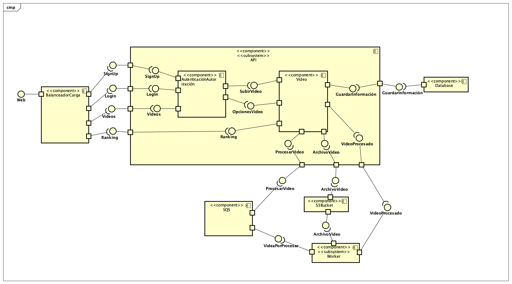
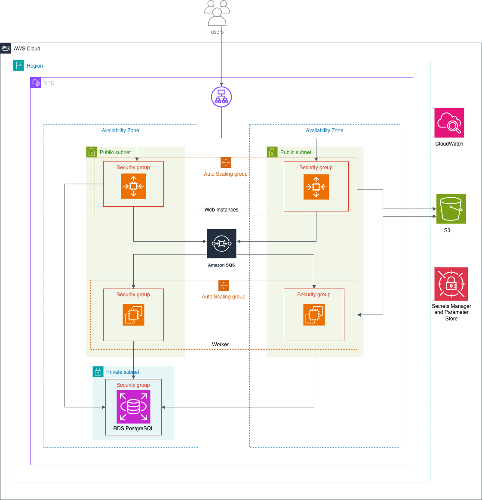

# Documentación Completa - API de Competencia de Habilidades

## Tabla de Contenidos
1. [Arquitectura y Tecnologías](#arquitectura-y-tecnologías)
2. [Arquitectura AWS](#Arquitectura-AWS)
3. [Cambio realizados](#Cambios-Realizados)
3. [Pruebas de carga](#Pruebas-de-Capacidad)
4. [Integraciones](#integraciones)

## Arquitectura y Tecnologías

### Diagrama de componentes

### Diagrama de despliegue

### Diagrama de arquitectura en aws

### Diagrama de flujo de procesos

### Modelo de datos

### Stack Tecnológico
- **Backend**: FastAPI (Python 3.11)
- **Base de Datos**: PostgreSQL 17
- **Cache/Broker**: AWS SQS
- **Procesamiento**: Celery Workers
- **Proxy Reverso**: Nginx
- **Autenticación**: JWT (JSON Web Tokens)
- **Validación**: Pydantic
- **Hashing**: bcrypt
- **Procesamiento Video**: FFmpeg
- **Testing**: pytest + Postman/Newman
- **Análisis de Código**: SonarCloud
- **CI/CD**: GitHub Actions

## Arquitectura AWS

### Balanceador de carga capa Web
Se implementó un Application Load Balancer (ALB) para distribuir el tráfico entrante entre las instancias EC2 del Web Server, mejorando la disponibilidad y escalabilidad de la aplicación.

El ALB cuenta redirige el tráfico entrante en el puerto 80 a un Target Group que corre la aplicación en el puerto 8000, el cuál está configura con un Launch Template que permite a la instancia levantarse con las características mencionadas en la siguiente sección y que además levanta un servicio mediante User Data de la instancia, como se ve en el siguiente [script](https://github.com/sjfuentes-uniandes/desarrollo-sw-nube/blob/main/user_data_web.sh).

El target group cuenta, a su vez con un Auto Scaling Group, que por restricciones de negocio escala hasta un máximo de 3 instancias. Este auto escalamiento sucede bajo el control automático de una política que trata de mantener el uso de la CPU en el 50% en todas las instancias del grupo.

### Cola de mensajería AWS SQS
Se utilizó AWS SQS como servicio de cola de mensajería para gestionar las tareas asíncronas entre el Web Server y los Workers. Esta integración permite un descoplamiento entre la capa Web y la capa Worker.

Esta cola de mensajería actúa como un balanceador de carga para la capa worker, ya que los mensajes son consumidos por instancias del Worker que están dentro de un Auto Scaling Group. Este ASG, por restricciones de negocio, está limitado a un máximo de 3 instancias. La métrica que se tomó en cuenta para su escalamiento es el uso de la CPU, cuando esta métrica llega a un 50% de uso el grupo comienza a escalar.

La configuración de los worker se realizón con el siguiente [script](../../user_data_worker_sqs.sh). Y se confiuró el grupo para que tenga alta disponibilidad poniendo las instancias en varias zonas de disponibilidad.

### Instancias EC2
Se configuraron instancias EC2 con las siguientes características para ambos grupos de autoescalamiento.
- **Sistema Operativo**: Ubuntu
- **vCPU**: 2 vCPUs
- **RAM**: 2 GiB
- **Disco**: 30 GB de almacenamiento

#### Puertos de conexión
| Instancia | Puerto | Protocolo | Descripción |
|--|--|--|--|
|  Web Server | 22  | TCP | Conexión SSH |
|  Web Server | 80  | TCP | HTTP tráfico entrante |  
|  Web Server | 8000  | TCP | Tráfico para la aplicación| 
| Worker | 22 | TCP | Conexión SSH |
| Worker | 6379 | TCP | Trabajo de la cola de mensajería |

### RDS Database
Se utilizó la siguiente configuración para la base de datos
 - **Motor de Base de Datos**: PostgreSQL 17
    - **vCPU**: 2 vCPUs
    - **RAM**: 2 GB
    - **Almacenamiento**: 100 GB SSD

### AWS SQS
Se implementó el uso de AWS SQS como cola de mensajería, lo que permite descoplar la capa web de la capa worker para el trabajo asíncrono. 

La capa web recibe la llamada de la API y coloca un nuevo mensaje en la cola de mensajería que mantendrá el mensaje visible hasta que el worker lo tome y lo procese. Este a su vez, una vez que lo procese lo eliminará de la cola de mensajes para seguir procesando el resto de mensajes. 

De esta forma se garantiza que ambas capas no tengas dependencia ni conexión directa una con la otra.

### S3
Se implementó el uso de S3 para el almacenamiento de archivo multimedia, de tal forma que dentro de S3 existe una ruta para los archivos subidos (uploaded) y para los archivos procesados por el worker (processed)

### Manejo de costos
Se implementó una alarte de costo con AWS CloudWatch y SNS Topic de tal forma que, una vez la proyección de gastos de la cuenta llegue a la mitad de los créditos, se pueda tomar las acciones necesarias para corregirlos. 

Además para el caso de la base de datos, solo se mantiene activa durante el usa, una vez se termina de usar la instancia se detiene y cuando se termine la entrega la instancia se destruirá.

### Manejo de datos sensibles
**AWS Secrets Manager**

Se utilizaron AWS Secrets Manager para el manejo de credenciales de la base de datos y el secreto para la generación de los tokens, evitando así almacenar credenciales sensibles directamente en el código fuente.

**AWS Parameter Store**

Debido a que el código necesita de ciertos parametros para su correcto funcionamiento, se implementó el uso de Parameter Store para almacenar dicha información y que el código sea capaz de consultar desde la nube y así evitar cambiar el código cuando estos valores cambien.

## Cambios Realizados
### **1. Migración de Redis a SQS**
- **Antes**: Workers dependían de Redis como broker
- **Después**: Workers consumen directamente de SQS
- **Beneficio**: Eliminación de punto único de falla y mejor escalabilidad

### **2. Auto Scaling Inteligente**
- **Métricas**: CPU (50%) + Cola SQS
- **Escalado automático**: 1-3 instancias según demanda
- **Cooldown**: 300s scale-out, 600s scale-in

### **Configuración Core**
| Archivo | Cambios | Descripción |
|---------|---------|-------------|
| `src/core/celery_app.py` | **Reescrito** | Broker SQS + fallback memory:// |
| `src/core/aws_config.py` | **Extendido** | Agregado SQS_QUEUE_URL + AWS_REGION |

### **Infraestructura**
| Archivo | Cambios | Descripción |
|---------|---------|-------------|
| `user_data_worker_sqs.sh` | **Nuevo** | Worker sin Redis, solo SQS |
| `user_data_web.sh` | **Actualizado** | AWS_DEFAULT_REGION para SQS |

### **Dependencias**
| Archivo | Cambios | Descripción |
|---------|---------|-------------|
| `requirements.txt` | **Agregado** | `kombu[sqs]`, `celery[sqs]` |

### **Testing**
| Archivo | Cambios | Descripción |
|---------|---------|-------------|
| `test/test_core.py` | **+50 tests** | Cobertura SQS + líneas específicas |
| `test/test_tasks.py` | **+15 tests** | Integración SQS en video_tasks |

## Pruebas de Capacidad

### `cloud_load_testing/`

### `capacity_planning/`

## Integraciones

#### Reporte de Análisis de SonarQube

