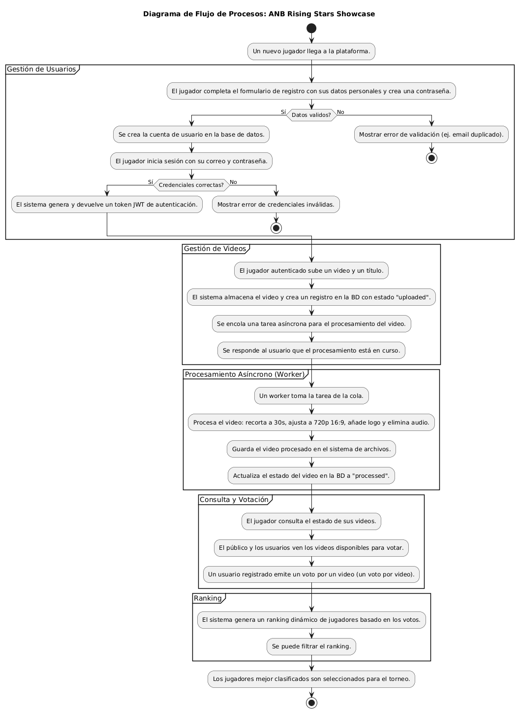
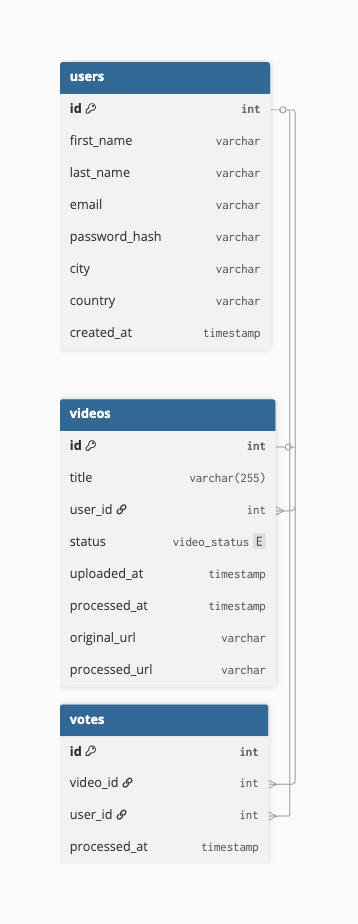

# Documentación Completa - API de Competencia de Habilidades

## Tabla de Contenidos
1. [Arquitectura y Tecnologías](#arquitectura-y-tecnologías)
2. [Arquitectura AWS](#Arquitectura-AWS)
3. [Cambio realizados](#Cambios-Realizados)
3. [Pruebas de carga](#Pruebas-de-Capacidad)
4. [Integraciones](#integraciones)

## Arquitectura y Tecnologías

### Diagrama de componentes

### Diagrama de despliegue

### Diagrama de arquitectura en aws

### Diagrama de flujo de procesos

### Modelo de datos

### Stack Tecnológico
- **Backend**: FastAPI (Python 3.11)
- **Base de Datos**: PostgreSQL 17
- **Cache/Broker**: AWS SQS
- **Procesamiento**: Celery Workers
- **Proxy Reverso**: Nginx
- **Autenticación**: JWT (JSON Web Tokens)
- **Validación**: Pydantic
- **Hashing**: bcrypt
- **Procesamiento Video**: FFmpeg
- **Testing**: pytest + Postman/Newman
- **Análisis de Código**: SonarCloud
- **CI/CD**: GitHub Actions

## Arquitectura AWS

### AWS ECS

Se implemento el uso de ECS para correr tanto la capa web como la capa worker, cada una de las capas corre en un servicio diferente dentro del cluster de la aplicación. Su ejecución y escalamiento es completamente independiente.

En el caso de la capa web, se tiene un balanceador de carga en frente de los contendores del servicio para manejar el incremento del trafico que se puede dar en la aplicación, además el servicio cuenta con una politica de auto escaladas de las tareas con un mínimo de 1 hasta un máximos de 3 como se ha trabajado durante todo el proyecto.

La capa worker cuenta con la misma política de auto escalamiento, en este caso no existe un balanceador de carga ya que esta capa obtiene los mensajes desde la cola de mensajería.

Es importante mencionar que la parte computacional del servicio esta configurado con ECS Fargate para disminuir la carga administrativa de las instancias computaciones para ECS.

### AWS ECR

Se utilizó ECR como registro de las imágenes docker que van a utilizar los contendores de la aplicación, desde aqui cada una de las tareas obtendrá la última imagen configurada para poder levantar el servicio en ECS.

### Cola de mensajería AWS SQS
Se utilizó AWS SQS como servicio de cola de mensajería para gestionar las tareas asíncronas entre el Web Server y los Workers. Esta integración permite un descoplamiento entre la capa Web y la capa Worker.

Esta cola de mensajería actúa como un balanceador de carga para la capa worker, ya que los mensajes son consumidos por instancias del Worker que están dentro de un Auto Scaling Group. Este ASG, por restricciones de negocio, está limitado a un máximo de 3 instancias. La métrica que se tomó en cuenta para su escalamiento es el uso de la CPU, cuando esta métrica llega a un 50% de uso el grupo comienza a escalar.

La configuración de los worker se realizón con el siguiente [script](../../user_data_worker_sqs.sh). Y se confiuró el grupo para que tenga alta disponibilidad poniendo las instancias en varias zonas de disponibilidad.

### RDS Database
Se utilizó la siguiente configuración para la base de datos
 - **Motor de Base de Datos**: PostgreSQL 17
    - **vCPU**: 2 vCPUs
    - **RAM**: 2 GB
    - **Almacenamiento**: 100 GB SSD

### AWS SQS
Se implementó el uso de AWS SQS como cola de mensajería, lo que permite descoplar la capa web de la capa worker para el trabajo asíncrono. 

La capa web recibe la llamada de la API y coloca un nuevo mensaje en la cola de mensajería que mantendrá el mensaje visible hasta que el worker lo tome y lo procese. Este a su vez, una vez que lo procese lo eliminará de la cola de mensajes para seguir procesando el resto de mensajes. 

De esta forma se garantiza que ambas capas no tengas dependencia ni conexión directa una con la otra.

### S3
Se implementó el uso de S3 para el almacenamiento de archivo multimedia, de tal forma que dentro de S3 existe una ruta para los archivos subidos (uploaded) y para los archivos procesados por el worker (processed)

### Manejo de costos
Se implementó una alarte de costo con AWS CloudWatch y SNS Topic de tal forma que, una vez la proyección de gastos de la cuenta llegue a la mitad de los créditos, se pueda tomar las acciones necesarias para corregirlos. 

Además para el caso de la base de datos, solo se mantiene activa durante el usa, una vez se termina de usar la instancia se detiene y cuando se termine la entrega la instancia se destruirá.

### Manejo de datos sensibles
**AWS Secrets Manager**

Se utilizaron AWS Secrets Manager para el manejo de credenciales de la base de datos y el secreto para la generación de los tokens, evitando así almacenar credenciales sensibles directamente en el código fuente.

**AWS Parameter Store**

Debido a que el código necesita de ciertos parametros para su correcto funcionamiento, se implementó el uso de Parameter Store para almacenar dicha información y que el código sea capaz de consultar desde la nube y así evitar cambiar el código cuando estos valores cambien.

## Cambios Realizados
### **1. Migración de EC2 a ECS**
- **Antes**: Uso de instancias EC2 para Web Server y Workers
- **Después**: Uso de AWS ECS con Fargate para ambos servicios

### **2. Contenerización con Docker**
- **Antes**: Despliegue manual en instancias EC2
- **Después**: Contenerización de la aplicación con Docker y despliegue en ECS

## Pruebas de Capacidad

### `cloud_load_testing/`
- **[escenario_1_capa_web_autoscalingV2/](../../cloud_load_testing/escenario_1_capa_web_autoscalingV3/)**: Pruebas de carga con JMeter para la arquitectura con SQS + Workers en ECS
  - Escenarios de 100, 200 y 300 usuarios concurrentes
  - Pruebas de escalamiento automático
  - Dashboards de resultados HTML

### `capacity_planning/`
- **[pruebas_de_carga_entrega4.md](../../capacity_planning/pruebas_de_carga_entrega5.md)**: Documentación completa de las pruebas de carga de la Entrega 5
  - Pruebas con Locust (Workers SQS)
  - Pruebas con JMeter (100, 200, 300 usuarios)

## Integraciones

#### Reporte de Análisis de SonarQube

